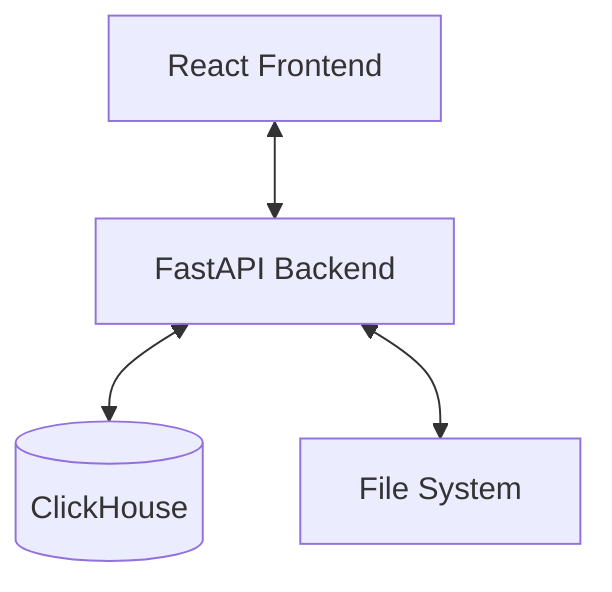

# PCAP Analyzer


A comprehensive web-based network packet analyzer built with FastAPI, React, and ClickHouse. This tool provides deep packet inspection, protocol analysis, network visualization, and detailed traffic insights.

## 🌟 Features

### Core Capabilities
- **PCAP File Analysis**: Upload and analyze `.pcap` and `.pcapng` files
- **Real-time Processing**: Live packet parsing with progress tracking
- **Multi-Protocol Support**: Extensive support for TCP, UDP, HTTP, HTTPS, DNS, TLS, ARP, SMB, ICMP, DHCP, SIP, Telnet, FTP, SSDP, and more.
- **Deep Packet Inspection**: Extract and analyze packet layers and metadata

### Analysis Views
- **Dashboard**: High-level overview of traffic, protocol distribution, and volume.
- **Packet Viewer**: Wireshark-like interface for inspecting individual packets.
- **Network Graph**: Interactive visualization of network topology and conversations.
- **GeoMap**: Global traffic visualization with GeoIP mapping.

### Dedicated Protocol Tabs
Detailed, filterable views for specific protocols:
- **Web**: HTTP, SSL/TLS
- **Infrastructure**: DNS, DHCP, ARP, ICMP
- **File Sharing**: SMB, FTP
- **Communication**: SIP, Telnet
- **Discovery**: SSDP
- **Transport**: TCP

### Security & Network Analysis
- **Open Ports**: Identify open ports and potential services.
- **Connections**: Analyze unique IP conversations and data volume.
- **Hosts & Servers**: Inventory of active hosts and servers.
- **Credentials**: (Experimental) Detection of cleartext credentials.

## 🏗️ Architecture



### Tech Stack
- **Frontend**: React, TypeScript, Vite, Tailwind CSS, Recharts, React Flow
- **Backend**: Python, FastAPI, Uvicorn, dpkt (Packet Parsing)
- **Database**: ClickHouse (High-performance analytics)

## 🚀 Getting Started

### Prerequisites
- Docker & Docker Compose
- **OR** Python 3.12+ and Node.js 18+ (for manual setup)

### Quick Start (Docker)

1. **Clone the repository**
   ```bash
   git clone https://github.com/jeevanelton/pcap.git
   cd pcap
   ```

2. **Configure Environment**
   ```bash
   cp .env.example .env
   # Edit .env to set your JWT_SECRET_KEY
   ```

3. **Start Application**
   ```bash
   docker-compose up -d
   ```

4. **Access**
   - Frontend: `http://localhost`
   - Backend API: `http://localhost:8000`

### Manual Setup

#### Backend
```bash
cd backend
python3 -m venv venv
source venv/bin/activate
pip install -r requirements.txt
# Ensure ClickHouse is running locally or update .env
uvicorn main:app --reload
```

#### Frontend
```bash
cd frontend
npm install
npm run dev
```

## 📖 Usage Guide

1. **Register/Login**: Create an account to secure your data.
2. **Create Project**: Organize your analysis sessions.
3. **Upload PCAP**: Drag and drop your capture file.
4. **Explore**: Use the sidebar to navigate between different views.
   - **Main**: Dashboard, Packets, Graph, Map.
   - **Protocols**: Specific views for HTTP, DNS, TCP, etc.
   - **Analysis**: Aggregated stats on ports, connections, etc.

## 🔧 Configuration

**Backend Environment Variables (.env)**
```bash
CLICKHOUSE_HOST=localhost
CLICKHOUSE_PORT=9000
CLICKHOUSE_USER=default
CLICKHOUSE_PASSWORD=
CLICKHOUSE_DATABASE=pcap_db
JWT_SECRET_KEY=change_this_in_production
```

## 🤝 Contributing

Contributions are welcome! Please fork the repository and submit a Pull Request.

## 📝 License

This project is licensed under the MIT License - see the [LICENSE](LICENSE) file for details.

## 👥 Authors

- **Jeevan Elton** - [@jeevanelton](https://github.com/jeevanelton)
